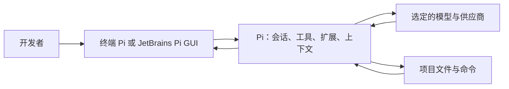
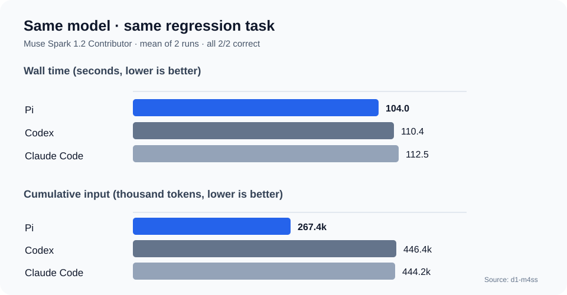
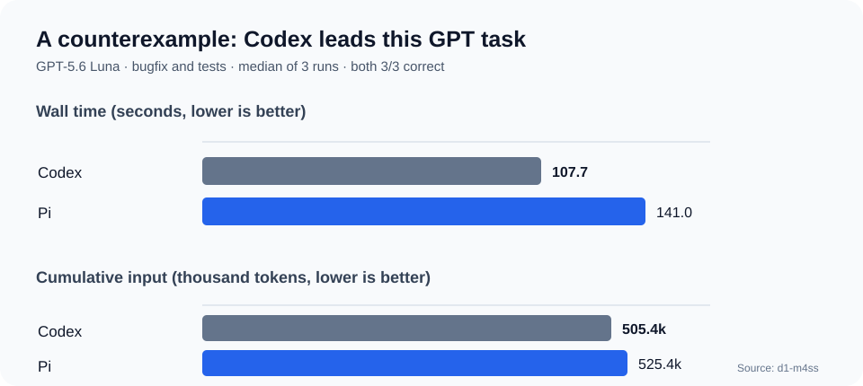

# 为什么在团队中试用 Pi：介绍、同模型实测与选择建议

> 资料核对日期：2026-09-22。本文面向研发同事。图表根据公开测试的原始数据重绘；它们不是本团队自行运行的测试结果。

## 一页结论

**Pi 值得作为团队的轻量、可定制 AI 编程智能体试用。** 它把模型、工具、会话和界面拆得比较清楚，支持多种模型与供应商、TypeScript 扩展、技能、会话分支、RPC 和 SDK。我们还可以通过本仓库的 Pi GUI，在 JetBrains IDE 中使用 Pi。[Pi 官方文档](https://pi.dev/docs/latest) · [本仓库的 Pi GUI 说明](../README.zh-CN.md)

性能证据需要说得更精确：一项公开的**同模型、同任务**测试中，Pi 修复一个真实仓库中的人为注入回归，累计输入上下文约比 Codex 和 Claude Code 少 **40%**，平均用时分别快 **5.9%** 和 **7.6%**，三者都是 **2/2 修复成功**。这证明了该任务中的效率优势，**不能证明 Pi 普遍更快或准确率更高**。同一测试的另一组 GPT 编程任务里，Codex 反而比 Pi 快，且累计输入略少。[测试项目与方法](https://github.com/d1-m4ss/harness-benchmark) · [完整结果](https://github.com/d1-m4ss/harness-benchmark/blob/main/RESULTS.md)

| 要回答的问题 | 目前可以说什么 |
| --- | --- |
| 生成速度更快？ | **特定同模型任务中略快**；2 次运行的差距很小，不能外推到所有任务。 |
| 准确率更高？ | **暂无证据**。该修复任务三者都是 2/2；另一项“无需修改”的克制性测试，Pi 反而低于另外两者。 |
| Token 使用量更少？ | **特定任务的累计输入上下文更少**。这不等同于输出 token、账单费用都更少。 |
| 为什么选 Pi？ | 小核心、模型选择灵活、扩展与嵌入能力强；适合希望掌控工作流和上下文的团队。 |

## Pi 是什么

Pi 是一个运行在终端的 AI 编程智能体框架（coding harness）。模型负责推理，Pi 负责组织对话、提供读文件／写文件／编辑／执行命令等工具、管理会话并把结果反馈给模型。官方的设计目标是**核心保持精简，按需扩展**；可通过扩展、技能、提示词模板、主题和包加入能力。[Pi 官方概览](https://pi.dev/docs/latest)

它不是一个固定模型。可以选择受支持的供应商和模型，也能配置自定义模型或供应商；因此“Pi 比 Codex/Claude Code 更好”的讨论必须先说明**模型是否真的相同**。[Pi 模型配置](https://pi.dev/docs/latest/models) · [Pi 供应商文档](https://pi.dev/docs/latest/providers)

Pi GUI 是**本仓库提供的 JetBrains 界面**，通过 Pi 的 RPC 模式连接本机 Pi CLI。它提供会话侧边栏、流式聊天、工具结果折叠、文件修改差异、模型切换和用量展示等功能。它改善的是 IDE 内的使用体验；**不能把 Pi GUI 的界面性能测试当作 Pi 对其他智能体的模型性能测试**。[Pi RPC 文档](https://pi.dev/docs/latest/rpc) · [Pi GUI README](../README.zh-CN.md)

## 真实案例 1：同模型修复配置优先级回归

公开测试项目 [Same Model, Different Harness](https://github.com/d1-m4ss/harness-benchmark) 把 `oh-my-opencode-slim` 固定到指定提交，在隔离的 Git worktree 中注入配置优先级回归，要求智能体定位并修复 `paths.ts`，同时更新 `paths.test.ts`。Pi、Codex、Claude Code 都使用经过路由核验的 **Muse Spark 1.2 Contributor**；每个工具运行 **2 次**。作者公开了[任务定义](https://github.com/d1-m4ss/harness-benchmark/blob/main/benchmark/cases.json)、[结果](https://github.com/d1-m4ss/harness-benchmark/blob/main/RESULTS.md)和[模型路由配置](https://github.com/d1-m4ss/harness-benchmark/blob/main/benchmark/providers.json)。

| 工具 | 平均墙钟时间 | 平均新输入 | 平均累计输入¹ | 修复成功 |
| --- | ---: | ---: | ---: | ---: |
| **Pi** | **103.96 秒** | **61.8k** | **267.4k** | **2/2** |
| Codex + OpenCodex | 110.42 秒 | 76.0k | 446.4k | 2/2 |
| Claude Code + OpenCodex | 112.46 秒 | 86.7k | 444.2k | 2/2 |

¹“累计输入”是一次任务中所有模型调用处理的输入 token 之和，含缓存读取的上下文；**不是最终回答的长度**。按表中数字计算，Pi 比 Codex 少约 **40.1%**，比 Claude Code 少约 **39.8%**。对应的平均用时只短约 **6.5 秒**和 **8.5 秒**。同一任务的两轮用时波动很大（例如 Pi 为 71.37 秒、136.54 秒），所以不宜把几秒差距称作稳定的速度优势。[逐轮数据与口径](https://github.com/d1-m4ss/harness-benchmark/blob/main/RESULTS.md#-task-4-controlled-synthetic-regression-mean-of-2-runs-n2)

**这个案例能证明：**在此固定模型、仓库和修复任务下，Pi 用更少的累计输入上下文完成了同样通过验证的修复。**不能证明：**Pi 在所有任务中更准、输出 token 一定更少、费用必然更低，或其速度优势具有统计稳定性。

## 真实案例 2：同模型 GPT 任务给出的反例

同一个测试项目还使用固定的 **GPT-5.6 Luna（medium）**，对真实仓库中的 `BackgroundJobBoard` 别名计数内存泄漏进行修复并运行单测。每个工具运行 **3 次**，下表为中位数。[完整结果](https://github.com/d1-m4ss/harness-benchmark/blob/main/RESULTS.md#-task-2-coding-bugfix--unit-tests-median-of-3-runs)

| 工具 | 用时中位数 | 新输入中位数 | 累计输入中位数 | 修复成功 |
| --- | ---: | ---: | ---: | ---: |
| **Codex** | **107.73 秒** | 50.3k | **505.4k** | 3/3 |
| Pi | 140.96 秒 | **44.2k** | 525.4k | 3/3 |

这里 Pi 的**新输入**较少，但完成时间比 Codex 长约 **31%**，**累计输入**也多约 **4%**。同模型比较也会因任务类型和智能体工作流而改变结论，因此团队不应把“Pi 始终最快、最省 token”当作采购或推广依据。

### 关于“准确率更高”的边界

在上述两个修复任务里，Pi 和对手都完成了修复，无法从 2/2 或 3/3 推出谁的总体准确率更高。公开测试还有一项“缺陷实际上已经修好，应保持 0 修改”的克制性任务：同为 Muse 模型，Codex **3/3**、Claude Code **2/2** 做到了 0 修改，Pi **2/3** 做到；Pi 的另一次运行添加了额外处理。[克制性任务结果](https://github.com/d1-m4ss/harness-benchmark/blob/main/RESULTS.md#%EF%B8%8F-task-3-scope-discipline--restraint-qualitative-behavioral-audit)

这些样本数都很小。更准确的说法是：**Pi 在一个已验证的修复案例中，以更少输入达到相同正确性；目前没有充分证据声称它的总体准确率领先 Codex 或 Claude Code。**

## 为什么团队仍值得选择 Pi

1. **可选择模型与供应商。** 模型能力、价格和限额会变化，Pi 可以让团队围绕实际任务选择模型。能否在各工具里运行完全相同的模型，要逐次核验路由，而不能只看命令行填写的模型名。[模型文档](https://pi.dev/docs/latest/models)
2. **可以按需扩展。** TypeScript 扩展可以提供工具、命令、事件处理和自定义 UI；技能与提示词模板适合沉淀团队流程。也要管理好扩展带来的权限与上下文开销。[扩展文档](https://pi.dev/docs/latest/extensions) · [技能文档](https://pi.dev/docs/latest/skills)
3. **会话可追踪和分支。** Pi 提供会话树、分支导航和压缩，适合回看“为什么这样改”以及从较早节点尝试新路径。[会话文档](https://pi.dev/docs/latest/sessions)
4. **容易嵌入现有工具。** RPC 模式可通过 stdin/stdout 的 JSON 协议接入 IDE 或内部工具；Pi GUI 已在本仓库实践了这一方式。[RPC 文档](https://pi.dev/docs/latest/rpc) · [Pi GUI README](../README.zh-CN.md)
5. **效率有可检验的潜力。** 上述 Muse 案例表明 Pi 在至少一种修复工作负载里显著减少累计输入。它值得在**我们自己的代码库与任务**上复测，再决定适用范围。

这不是说 Codex 或 Claude Code 缺少扩展、IDE 集成或自动化能力。两者也有各自的工具链；最终选择应看团队常做的任务、模型访问方式、权限要求和实际测量结果。[Codex CLI 文档](https://learn.chatgpt.com/docs/codex/cli) · [Claude Code 概览](https://code.claude.com/docs/en/overview)

## 建议给团队的复测方案

| 控制项 | 做法 |
| --- | --- |
| 模型 | 使用同一模型版本、同一供应商路由、相同推理档位；记录**实际返回的模型 ID**，防止静默回退。 |
| 任务 | 选 10–20 个团队真实任务：小 bug、跨文件改动、只读定位、已有修复时的“不要改”。先写验收标准。 |
| 环境 | 每轮从相同提交创建独立 worktree；固定依赖、系统提示、工具权限、MCP、超时和网络条件。 |
| 顺序 | 每任务每工具至少 3–5 次，轮换运行顺序；标记超时、重试、模型切换和人工干预。 |
| 正确性 | 自动测试、隐藏验收用例和人工审查一起评估；记录多余修改、回归和安全问题。 |
| 效率 | 同时记录墙钟时间、首 token 时间、模型调用次数、新输入、缓存读取、输出、费用；**不要只比一个 token 总数**。 |
| 输出 | 公布原始日志的脱敏版本、任务定义、逐轮结果和失败案例；用中位数与分布，而非单次最佳值。 |

**建议采用的结论模板：**“在我们的〔任务类别〕、〔模型版本〕、〔工具版本〕和〔日期〕下，Pi 的任务成功率为 X/Y，耗时中位数为 A 秒，累计输入中位数为 B token；与 Codex/Claude Code 相比差异为……。”未完成复测之前，不建议向同事宣称普遍性胜出。

## 资料与可追溯性

- [Pi 官方文档](https://pi.dev/docs/latest)：定位、安装、扩展、模型、会话及 RPC。
- [Same Model, Different Harness 项目](https://github.com/d1-m4ss/harness-benchmark)：第三方公开测试；不是 Pi 官方或本团队测试。
- [完整结果](https://github.com/d1-m4ss/harness-benchmark/blob/main/RESULTS.md)、[任务定义](https://github.com/d1-m4ss/harness-benchmark/blob/main/benchmark/cases.json)、[模型配置](https://github.com/d1-m4ss/harness-benchmark/blob/main/benchmark/providers.json)：可核对本文表格和测试设计。
- [Codex CLI 官方文档](https://learn.chatgpt.com/docs/codex/cli) 与 [Claude Code 官方文档](https://code.claude.com/docs/en/overview)：用于核对产品定位。
- [Pi GUI README](../README.zh-CN.md) 与 [本仓库功能测试报告](../TEST_REPORT.md)：只用于说明本团队的 IDE 集成和功能测试，**不构成三款智能体的性能对比证据**。

> **限制：**公开测试只有少量任务与少量重复；工具配置接近日常使用但并非完全相同的“纯默认安装”，Codex 和 Claude Code 使用了 OpenCodex 路由。数据可以帮助提出假设，不能替代本团队的可复现评估。
